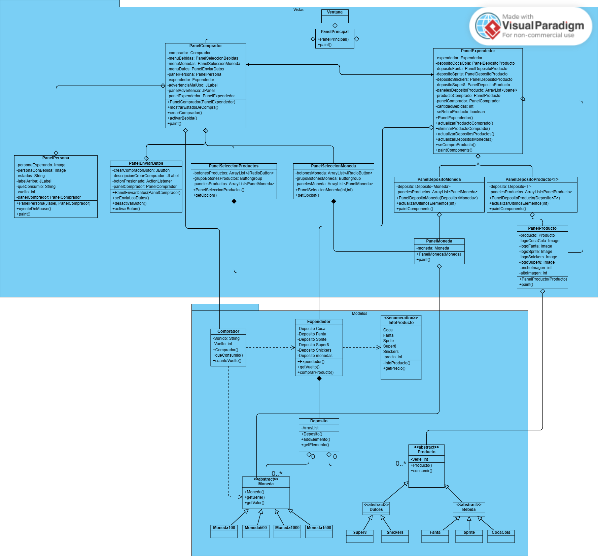

# Tarea 3 de programacion 2

## Nombre integrantes del grupo
- Carlos Tomás Álvarez Norambuena (Karantooo)
- Benjamin Alonso Espinoza Henriquez (DyStorzion)
## Diagrama UML

## Instrucciones para la ejecucion del proyecto
Simplemente hacer un git clone del repositorio https://github.com/DyStorzion/Tarea3Progra.git y abrir la carpeta con intellij. 